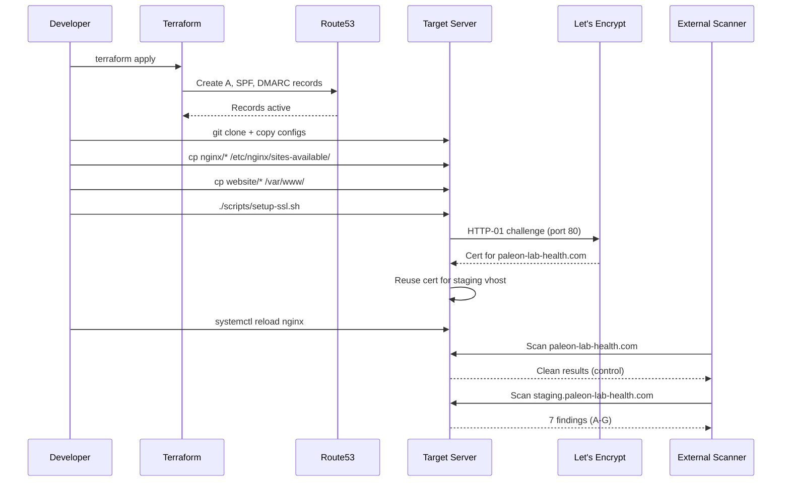

# Architecture — Site 2 (CareBridge Health)

## High-Level Design

```
┌─────────────────────────────────────────────────────────────────┐
│                        Internet / Scanner                        │
└──────────────────────────┬──────────────────────────────────────┘
                           │
              ┌────────────▼────────────┐
              │   AWS Route53 DNS       │
              │  (paleon-lab-health.com)│
              │  - A records → Server IP│
              │  - TXT: SPF (weak)      │
              │  - TXT: DMARC (p=none)  │
              │  - NO DKIM, CAA, DNSSEC │
              └────────────┬────────────┘
                           │
              ┌────────────▼────────────┐
              │   Target Server         │
              │   (Ubuntu + Nginx)      │
              │                         │
              │  ┌───────────────────┐  │
              │  │ paleon-lab-health │  │  ← Main Site (Clean Control)
              │  │     .com:443      │  │     Valid TLS, Strong Headers
              │  │ /var/www/paleon-  │  │     autoindex off
              │  │ lab-health.com    │  │
              │  └───────────────────┘  │
              │                         │
              │  ┌───────────────────┐  │
              │  │staging.paleon-lab │  │  ← Staging Portal (Vulnerable)
              │  │ -health.com:443   │  │     Mismatched Cert (Main's)
              │  │ /var/www/staging. │  │     autoindex on /uploads/
              │  │ paleon-lab-health │  │     X-Powered-By: PHP/5.6.40
              │  │ .com              │  │
              │  └───────────────────┘  │     Server: Apache/2.2.8
              │                         │     Server: Apache/2.2.8
              └─────────────────────────┘
```

---

## Component Breakdown

### 1. AWS Provisioning Layer (Terraform → EC2 + Security Group + EIP + Route53)

**Files:** `infrastructure/main.tf`, `infrastructure/dns/route53.tf`

Terraform provisions the target web instance, security group, Elastic IP, and Route53 records for the domain and staging hostname. The DNS layer remains a component of the same deployment, not a standalone DNS-only design.

> Note: This deployment assumes an existing default VPC and subnet in `eu-west-2`; the Terraform code does not build a custom VPC or network topology.

| Record | Value | Purpose |
|--------|-------|---------|
| `A @` | Server IP | Main site |
| `A staging` | Server IP | Staging portal |
| `TXT @` | `v=spf1 ?all` | **SITE2-001**: Weak SPF (neutral/all) |
| `TXT _dmarc` | `v=DMARC1; p=none; rua=mailto:dmarc@paleon-lab-health.com` | **SITE2-002**: DMARC monitor-only |
| (none) | — | **SITE2-003**: No DKIM `_domainkey` record |
| (none) | — | **SITE2-004**: No CAA records |
| (none) | — | **SITE2-005**: DNSSEC not enabled |

**Design Decision:** All DNS weaknesses are implemented by *omission* or *weak configuration* — no "fake" records that could be abused. Terraform simply doesn't create DKIM/CAA/DNSSEC resources.

---

### 2. TLS Layer (Let's Encrypt + Nginx)

**Files:** `scripts/setup-ssl.sh`, `nginx/main-site.conf`, `nginx/staging.conf`

#### Main Site (`paleon-lab-health.com`)
- Certbot obtains valid cert via webroot validation before the final HTTPS vhost is enabled
- Cert covers: `paleon-lab-health.com`, `www.paleon-lab-health.com`
- Nginx config: `ssl_certificate /etc/letsencrypt/live/paleon-lab-health.com/fullchain.pem`

#### Staging Portal (`staging.paleon-lab-health.com`)
- **Same main certificate reused** (intentional mismatch)
- Nginx config: `ssl_certificate /etc/letsencrypt/live/paleon-lab-health.com/fullchain.pem`
- **Result:** Scanner sees CN=SAN=paleon-lab-health.com but connects to staging.paleon-lab-health.com → **SITE2-006** (hostname mismatch, severity: high)

**Why not self-signed?** Self-signed certs trigger different scanner findings (untrusted CA). A valid cert for the *wrong hostname* is a distinct, common misconfiguration class.

---

### 3. HTTP Layer (Nginx Virtual Hosts)

#### Main Site Config (`nginx/main-site.conf`)

```nginx
server {
    listen 443 ssl http2;
    server_name paleon-lab-health.com www.paleon-lab-health.com;

    # Valid cert
    ssl_certificate /etc/letsencrypt/live/paleon-lab-health.com/fullchain.pem;
    ssl_certificate_key /etc/letsencrypt/live/paleon-lab-health.com/privkey.pem;

    # Strong security headers
    add_header Strict-Transport-Security "max-age=31536000; includeSubDomains; preload" always;
    add_header Content-Security-Policy "default-src 'self'; script-src 'self' 'unsafe-inline'; style-src 'self' 'unsafe-inline'; img-src 'self' data:; font-src 'self'; connect-src 'self'; frame-ancestors 'none';" always;
    add_header X-Frame-Options "DENY" always;
    add_header X-Content-Type-Options "nosniff" always;
    add_header Referrer-Policy "strict-origin-when-cross-origin" always;
    add_header Permissions-Policy "geolocation=(), microphone=(), camera=()" always;

    # Hide version
    server_tokens off;

    # No directory listing
    autoindex off;

    root /var/www/paleon-lab-health.com;
    index index.html;
}
```

**Result:** Clean baseline — scanner should find **no** TLS, header, or disclosure issues.

#### Staging Config (`nginx/staging.conf`)

```nginx
server {
    listen 443 ssl http2;
    server_name staging.paleon-lab-health.com;

    # MISMATCHED CERT (main site's cert)
    ssl_certificate /etc/letsencrypt/live/paleon-lab-health.com/fullchain.pem;
    ssl_certificate_key /etc/letsencrypt/live/paleon-lab-health.com/privkey.pem;

    # WEAK HEADERS — deliberate disclosure
    add_header X-Powered-By "PHP/5.6.40" always;       # SITE2-008, SITE2-009
    add_header Server "Apache/2.2.8" always;           # SITE2-008, SITE2-009
    # Note: NO HSTS, NO CSP, NO X-Frame-Options

    server_tokens on;                                   # Version disclosure

    root /var/www/staging.paleon-lab-health.com;
    index index.html;

    # DIRECTORY LISTING on /uploads/ — SITE2-007
    location /uploads/ {
        autoindex on;
        autoindex_exact_size off;
        autoindex_localtime on;
    }
}
```

**Result:** 4 deliberate findings on staging only.

---

### 4. Content Layer (Static Sites)

#### Main Site (`website/main/`)
- 7 pages: Home, About, Platform, Providers, Patients, Security, Contact
- Modern teal/navy design, responsive CSS Grid/Flexbox
- No external dependencies (self-contained CSS/JS)
- Security page documents real security posture (transparency)

#### Staging Portal (`website/staging/`)
- Legacy visual style (boxy, muted colors, serif fonts)
- Synthetic patient data: `PATIENT-20481`, `DOB: 1952-03-14`, `NHS: 943 476 5921`
- **All data is fake** — no real PII
- `/uploads/` contains 3 demo files:
  - `patient-record-demo.txt` — Text format fake record
  - `lab-result-demo.csv` — CSV with synthetic lab values
  - `portal-export-demo.txt` — Fake export manifest

---

### 5. Validation & CI

**`validate.sh`** (runs locally, no network required)
- Directory structure existence
- `expected.yaml` YAML syntax (via Python/PyYAML)
- Terraform fmt/validate (warn-only, network-dependent)
- Secret scan: blocks `-----BEGIN *PRIVATE KEY-----` patterns
- Key file presence check

**`scripts/validate.sh`** (runs on deployed host)
- TLS cert validity & SANs
- Security header presence/absence
- Directory listing behavior
- DNS record verification

---

## Finding-to-Implementation Mapping

| Finding ID | Category | Implementation Location |
|------------|----------|------------------------|
| SITE2-001 | email_security | `infrastructure/dns/route53.tf` → SPF TXT `v=spf1 ?all` |
| SITE2-002 | email_security | `infrastructure/dns/route53.tf` → DMARC TXT `p=none` |
| SITE2-003 | email_security | `infrastructure/dns/route53.tf` → **No** DKIM resource |
| SITE2-004 | dns_security | `infrastructure/dns/route53.tf` → **No** CAA resource |
| SITE2-005 | dns_security | `infrastructure/dns/route53.tf` → **No** DNSSEC enablement |
| SITE2-006 | tls | `nginx/staging.conf` → `ssl_certificate` = main site cert |
| SITE2-007 | information_disclosure | `nginx/staging.conf` → `location /uploads/ { autoindex on; }` |
| SITE2-008 | information_disclosure | `nginx/staging.conf` → `add_header X-Powered-By "PHP/5.6.40"` |
| SITE2-009 | software_version | `nginx/staging.conf` → `add_header Server "Apache/2.2.8"` |

---

## Guardrails (must_not_flag)

| ID | Protected Asset | Rationale |
|----|----------------|-----------|
| SITE2-MNF-001 | Main site TLS | Valid cert, correct hostname |
| SITE2-MNF-002 | Main site HSTS | Header present with preload |
| SITE2-MNF-003 | Main site CSP | Restrictive policy deployed |
| SITE2-MNF-004 | Main site directory listing | `autoindex off` globally |
| SITE2-MNF-005 | Main site version disclosure | `server_tokens off` |

These prevent scanner false positives on the **control surface**.

---

## Security Boundaries

```
┌────────────────────────────────────────────────────┐
│                  TRUST BOUNDARY                     │
│  ┌─────────────────┐  ┌─────────────────────────┐  │
│  │   Main Site     │  │    Staging Portal       │  │
│  │  (Production)   │  │  (Test/Staging Only)    │  │
│  │                 │  │                         │  │
│  │ • Valid TLS     │  │ • Mismatched TLS        │  │
│  │ • Strong headers│  │ • Weak headers          │  │
│  │ • No disclosure │  │ • Directory listing     │  │
│  │                 │  │ • Synthetic data only   │  │
│  └────────┬────────┘  └───────────┬─────────────┘  │
│           │                       │                │
│           └───────────┬───────────┘                │
│                       ▼                            │
│            ┌──────────────────┐                    │
│            │   Single Nginx   │                    │
│            │   (Same Process) │                    │
│            └──────────────────┘                    │
└────────────────────────────────────────────────────┘
```

**Critical:** Both vhosts run in the **same Nginx process**. This is intentional — the lab tests *scanner ability to differentiate hostnames*, not network segmentation. Isolation is at the **configuration layer**, not process/network layer.

---

## Deployment Flow



---

## Extensibility Points

| Extension | How |
|-----------|-----|
| Add new finding | 1. Add nginx config / DNS record<br>2. Add entry to `expected.yaml`<br>3. Add guardrail if needed |
| New subdomain | Add A record in `route53.tf`, new vhost in `nginx/`, content in `website/` |
| Real compute (EC2) | Add `aws_instance` resource to `main.tf`, use user_data for bootstrap |
| CI/CD pipeline | Wrap `deploy.sh` in GitHub Actions / GitLab CI |

---

## Non-Goals

- ❌ Real application backend (no PHP, no database)
- ❌ Real authentication / session handling
- ❌ Network-level isolation (VPC, security groups between vhosts)
- ❌ WAF / rate limiting / bot protection
- ❌ Log aggregation / SIEM integration
- ❌ High availability / load balancing

This is a **scanner validation fixture**, not a production architecture.

---

## References

- [Site 1 (Fintech) expected.yaml](../fintech/expected.yaml) — Pattern reference
- [Scanner Taxonomy](/docs/scanner-taxonomy.md) — Finding categories/severities
- [Let's Encrypt Integration Guide](https://letsencrypt.org/docs/)
- [Nginx Security Headers](https://nginx.org/en/docs/http/ngx_http_headers_module.html)